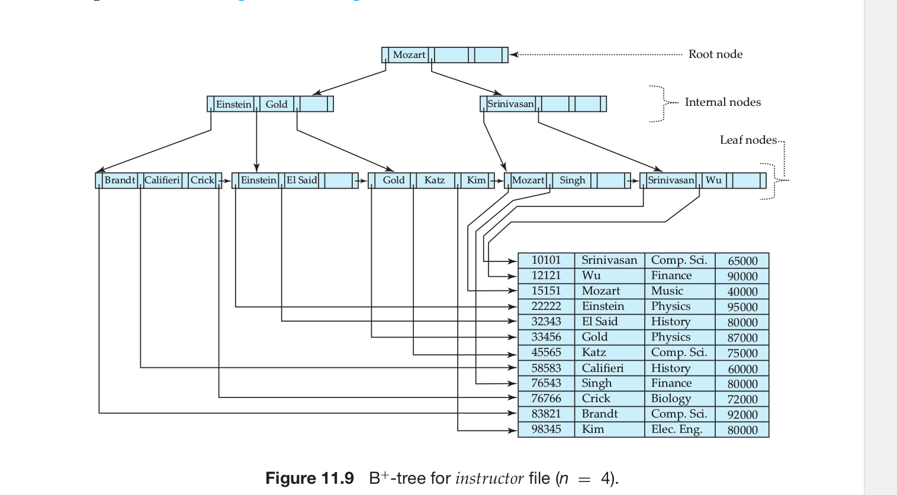

There are two basic kinds of indices:
• Ordered indices. Based on a sorted ordering of the values.
• Hash indices. Based on a uniform distribution of values across a range of buckets. The bucket to which a value is assigned is determined by a function,
called a hash function.

An attribute or set of attributes used to look up records in a file is called a search key. Note that this definition of key differs from that used in primary key,
candidate key, and superkey.
Ordered Indices
A file may have several indices, on different search keys. If the file containing the records is sequentially ordered, a clustering index is an index
whose search key also defines the sequential order of the file. Clustering indices are also called primary indices; the term primary index may appear to denote an
index on a primary key, but such indices can in fact be built on any search key. The search key of a clustering index is often the primary key, although that is
not necessarily so. Indices whose search key specifies an order different from the sequential order of the file are called nonclustering indices, or secondary indices. The terms “clustered” and “nonclustered” are often used in place of “clustering” and “nonclustering.”
There are two types of ordered indices that we can use:
Dense index: In a dense index, an index entry appears for every search-key value in the file.
Sparse index: In a sparse index, an index entry appears for only some of the search-key values.

B + -Tree Index Files
The main disadvantage of the index-sequential file organization is that perfor-mance degrades as the file grows, both for index lookups and for sequential scans through the data. Although this degradation can be remedied by reorganization of the file, frequent reorganizations are undesirable.
The B + tree index structure is the most widely used of several index structures that maintain their efficiency despite insertion and deletion of data. A B + tree index takes the form of a balanced tree in which every path from the root of the tree to a leaf of the tree is of the same length.

observe that only the leaf nodes contain pointers to actual data.
